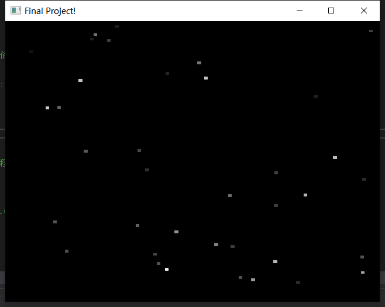
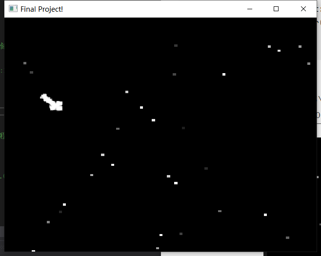
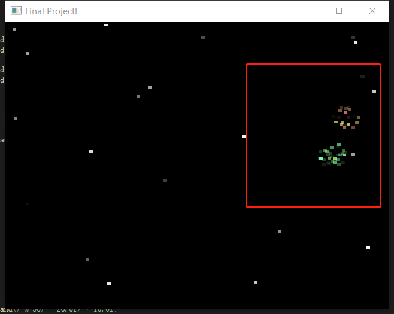
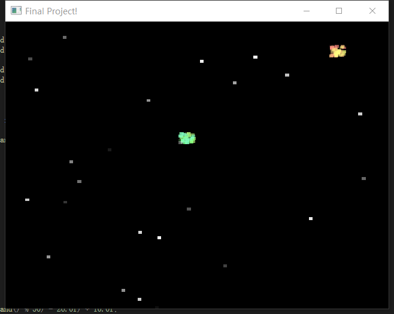
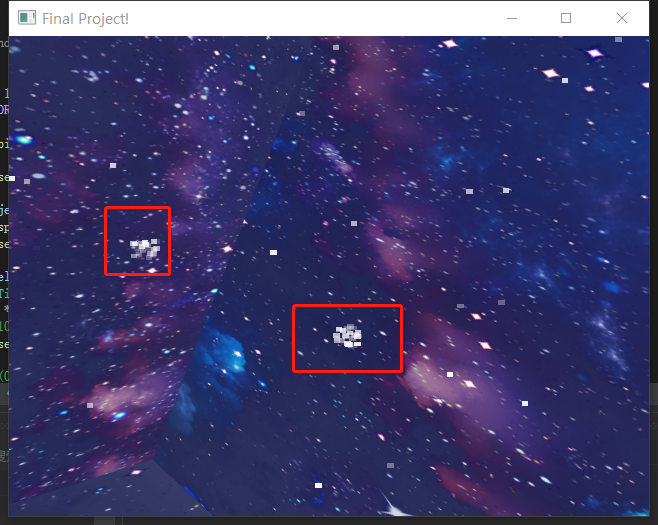

## 期末项目个人报告——`Meteor`类

李钰  19335112

​		在本次项目中我的主要任务是制作流星、爆炸的效果。主要内容就是是通过创建大量的随机粒子，为其赋予颜色，x、y、z方向不同的初始速度和加速度，以及衰减参数等等，实现星星闪烁、流星划过、以及星体小爆炸的效果。我创建了一个`Meteor`类，用来封装我的流星部分。下面介绍类的实现过程，以及和整个项目融合的过程。

**数据成员**：主要部分其实是一个包含所有粒子的结构体数组，其中有每个粒子的坐标位置、颜色参数，以及各个方向的加速度。`active`若为真则表示该粒子是活的需要绘制，若为`false`则不绘制该粒子。变量`life`和`fade`来控制粒子显示多久以及显示时候的亮度，随着`life`数值的降低`fade`的数值也相应减低，这将导致一些粒子比其他粒子燃烧的时间长。其他参数即为一些基本属性值，`m_Rainbow`表示是否为彩虹模式，为真时各个粒子的眼色是五彩的。其他参见注释。

```C++
QWidget* widget;

static const int MAX_PARTICLES = 2000;          //最大粒子数
static const GLfloat COLORS[12][3];             //彩虹的颜色
bool m_Rainbow;                                 //是否为彩虹模式
GLuint m_Color;                                 //当前的颜色
float m_Slowdown;                               //减速粒子
float m_xSpeed;                                 //x方向的速度
float m_ySpeed;                                 //y方向的速度
float m_Deep;                                   //移入屏幕的距离

int screen_width;
int screen_height;		

struct Particle                                 //创建粒子结构体
{
bool active;                                	//是否激活
float life;                                 	//粒子生命
float fade;                                 	//衰减速度

float r, g, b;                              	//粒子颜色
float x, y, z;                              	//位置坐标
float xi, yi, zi;                           	//各方向速度
float xg, yg, zg;                           	//各方向加速度
} m_Particles[MAX_PARTICLES];                   //存放所有粒子的数组
```

**成员函数**

- 构造函数`Meteor(QWidget* widget)`：创建一个Meteor对象，并且给`widget`赋值，初始化一些属性值。这里将粒子初始化为在屏幕的随机两处产生小爆炸；其余的粒子随机出现，模拟宇宙中远处一闪一闪的星星的效果。我们通过随机数来设置粒子退色的快慢，我们取0~999的随机数，然后平分1000份来得到一个很小的浮点数，最后结果加上0.001f来使`fade`速度值不为0。

  ```C++
  Meteor::Meteor(QWidget* widget)
  	: widget(widget) {
  	m_Rainbow = false;
  	m_Color = 0;
  	m_Slowdown = 2.0f;
  	m_xSpeed = 0.0f;
  	m_ySpeed = 0.0f;
  	m_Deep = -40.0f;
  
  	screen_width = widget->width();
  	screen_height = widget->height();
  
  	float row1 = rand() % screen_width + (rand() % 100) * 0.01;
  	float col1 = rand() % screen_height + (rand() % 100) * 0.01;
  
  	float row2 = rand() % screen_width + (rand() % 100) * 0.01;
  	float col2 = rand() % screen_height + (rand() % 100) * 0.01;
  
  	float rand_y = rand() % 500 * 0.1;
  
  
  	for (int i = 0; i < MAX_PARTICLES; i++)                 //循环初始化所以粒子
  	{
  		m_Particles[i].active = true;						//使所有粒子为激活状态
  		m_Particles[i].life = 1.0f;							//所有粒子生命值为最大
  		//随机生成衰减速率
  		m_Particles[i].fade = float(rand() % 1000) / 1000.0f + 0.001;
  
  		//粒子的颜色——白色
  		m_Particles[i].r = 1.0f;
  		m_Particles[i].g = 1.0f;
  		m_Particles[i].b = 1.0f;
  
  		//粒子的初始位置——随便给
  
  		if (i < MAX_PARTICLES / 10) {
  			m_Particles[i].x = row1;
  			m_Particles[i].y = col1;
  			m_Particles[i].z = -5.0f;
  
  			//随机生成x、y、z轴方向速度
  			m_Particles[i].xi = float((rand() % 50) - 26.0f) * 10.0f;
  			m_Particles[i].yi = float((rand() % 50) - 25.0f) * 10.0f;
  		}
  		else if (i < MAX_PARTICLES / 10 * 2) {
  			m_Particles[i].x = row2;
  			m_Particles[i].y = col2;
  			m_Particles[i].z = 5.0f;
  
  			//随机生成x、y、z轴方向速度
  			m_Particles[i].xi = float((rand() % 50) - 26.0f) * 10.0f;
  			m_Particles[i].yi = float((rand() % 50) - 25.0f) * 10.0f;
  		}
  		else {
  			m_Particles[i].fade = float(rand() % 1000) / 1000.0f + 0.001;
  			m_Particles[i].x = 5 + rand() % 10 -5;
  			m_Particles[i].y = rand_y + rand() % 10 + 10;
  			m_Particles[i].z = 0.0f;
  
  			m_Particles[i].xi = fabs(float((rand() % 50) - 26.0f) * 10.0f);
  			m_Particles[i].yi = -fabs(float((rand() % 50) - 25.0f) * 10.0f);
  		}
  
  
  		m_Particles[i].xg = 2.0f;                       //设置x方向加速度为2.0
  		m_Particles[i].yg = -0.8f;                      //设置y方向加速度为-0.8
  		m_Particles[i].zg = 0.0f;                       //设置z方向加速度为0
  	}
  }
  ```

- 初始化函数`initMeteor()`：这里主要部分是融合因子的设置，可以使粒子消失时有渐渐消失的感觉，并且粒子可以有不同的颜色，粒子和背景之间的颜色也不同，所以我们需要启用融合因子。然后我们禁用了深度测试，因为如果启用深度测试的话，纹理之间会出现覆盖现象，那样画面简直一团糟。

  ```C++
  void Meteor::initMeteor() {
  	glEnable(GL_TEXTURE_2D);                            //启用纹理映射
  	glShadeModel(GL_SMOOTH);                            //启用阴影平滑
  	glClearDepth(1.0);                                  //设置深度缓存
  	glDisable(GL_DEPTH_TEST);                           //禁止深度测试
  	glEnable(GL_BLEND);                                 //启用融合
  	glBlendFunc(GL_SRC_ALPHA, GL_ONE_MINUS_SRC_ALPHA);	//设置融合因子
  	glHint(GL_PERSPECTIVE_CORRECTION_HINT, GL_NICEST);  //告诉系统对透视进行修正
  	glHint(GL_POINT_SMOOTH_HINT, GL_NICEST);
  }
  ```

- 绘制函数`drawMeteor()`：普通的绘制函数就只是绘制大量的闪烁的星星。这里我们通过`GL_TRIANGLE_STRIP`绘制粒子，位置随机产生、消失时间随机生成。如果一个粒子消失，则产生新的粒子。

  ```C++
  void Meteor::drawMeteor() {
  	glLoadIdentity();                                   //重置模型观察矩阵
  
  	for (int i = 0; i < 1000; i++)                 //1000个粒子当一闪一闪的星星
  	{
  		if (m_Particles[i].active)                      //如果粒子为激活的
  		{
  			float x = m_Particles[i].x;                 //x轴位置
  			float y = m_Particles[i].y;                 //y轴位置
  			float z = m_Particles[i].z + m_Deep;        //z轴位置
  			
              m_Particles[i].r = 1.0f;  //设置颜色
  			m_Particles[i].g = 1.0f;
  			m_Particles[i].b = 1.0f;
              
  			glBegin(GL_TRIANGLE_STRIP);                 //绘制三角形带
  			glTexCoord2d(1, 1);
  			glVertex3f(x + 0.5f, y + 0.5f, z);
  			glTexCoord2d(0, 1); glVertex3f(x - 0.5f, y + 0.5f, z);
  			glTexCoord2d(1, 0); glVertex3f(x + 0.5f, y - 0.5f, z);
  			glTexCoord2d(0, 0); glVertex3f(x - 0.5f, y - 0.5f, z);
  			glEnd();
  
  			//更新各方向坐标及速度
  			m_Particles[i].x += m_Particles[i].xi / (m_Slowdown * 1000);
  			m_Particles[i].y += m_Particles[i].yi / (m_Slowdown * 1000);
  			m_Particles[i].z += m_Particles[i].zi / (m_Slowdown * 1000);
  			m_Particles[i].xi += m_Particles[i].xg;
  			m_Particles[i].yi += m_Particles[i].yg;
  			m_Particles[i].zi += m_Particles[i].zg;
  
  			m_Particles[i].life -= m_Particles[i].fade; //减少粒子的生命值
  			
  			if (m_Particles[i].life < 0.0f)             //如果粒子生命值小于0
  			{
  				m_Particles[i].life = 1.0f;             //产生一个新粒子
  				m_Particles[i].fade = float(rand() % 100) / 1000.0f + 0.003f;
  
  				m_Particles[i].r = 1.0f;  //设置颜色
  				m_Particles[i].g = 1.0f;
  				m_Particles[i].b = 1.0f;
  
  				float row = rand() % screen_width + (rand() % 100) * 0.01;
  				float col = rand() % screen_height + (rand() % 100) * 0.01;
  
  				m_Particles[i].x = row;                //粒子随机出现
  				m_Particles[i].y = col;
  				m_Particles[i].z = 0.0f;
  
  				//随机生成粒子速度
  				m_Particles[i].xi = m_xSpeed + float((rand() % 60) - 32.0f);
  				m_Particles[i].yi = m_ySpeed + float((rand() % 60) - 30.0f);
  				m_Particles[i].zi = float((rand() % 60) - 30.0f);
  			}
  		}
  	}
  	if (m_Rainbow)                                      //如果为彩虹模式
  	{
  		m_Color++;                                      //进行颜色的变换
  		if (m_Color > 11)
  		{
  			m_Color = 0;
  		}
  	}
  }
  ```

- 产生爆炸效果`explode()`：用500个粒子产生两处小爆炸，其余粒子还是闪烁的状态。产生小爆炸令x、y、z的各个方向都有速度即可。

  ```C++
  void Meteor::explode() {					//产生两处爆炸的效果
  
  	float row1 = rand() % 100 + (rand() % 100) * 0.01;
  	float col1 = rand() % 100 + (rand() % 100) * 0.01;
  	float row2 = rand() % 100 + (rand() % 100) * 0.01;
  	float col2 = rand() % 100 + (rand() % 100) * 0.01;
  
  	int num_explode = 500;
  	for (int i = 0; i < num_explode; i++)
  	{
  		m_Particles[i].fade = fabs(rand() % 50 - 25) * 0.01;
  
  		if (i < num_explode / 2) {
  			m_Particles[i].x = row1;
  			m_Particles[i].y = col1;
  			m_Particles[i].z = 0;	
  		}
  		else {
  			m_Particles[i].x = row2;
  			m_Particles[i].y = col2;
  			m_Particles[i].z = 0.0f;
  
  		}
  
  		//随机生成速度
  		m_Particles[i].xi = float((rand() % 50) - 26.0f) * 10.0f;
  		m_Particles[i].yi = float((rand() % 50) - 25.0f) * 10.0f;
  		m_Particles[i].zi = float((rand() % 50) - 25.0f) * 10.0f;
  
  		m_Particles[i].xg = 0.0f;                       //设置x方向加速度为2.0
  		m_Particles[i].yg = -0.8f;                      //设置y方向加速度为-0.8
  		m_Particles[i].zg = 0.0f;                       //设置z方向加速度为0
  
  		//设置粒子的颜色
  		m_Particles[i].r = 1.0f;
  		m_Particles[i].g = 1.0f;
  		m_Particles[i].b = 1.0f;
  	}
  }
  ```

- 产生流星效果`meteor_run()`：要想绘制出流星的效果，即让大量的粒子同时出现构成一个流星的形状，然后让他们拥有相近的速度和加速度一起坠落即可。

  ```C++
  void Meteor::meteor_run() {
  
  	float speed_x = fabs(float((rand() % 50) - 26.0f) * 10.0f + 5);;
  	float speed_y = -fabs(float((rand() % 50) - 25.0f) * 10.0f + 5);
  	float pos_x = -10;	//在画外产生
  	float pos_y = rand() % 50 + 50;		//随机的y坐标
  
  	int num_meteor = MAX_PARTICLES * 2 / 3;
  	for (int i = 0; i < MAX_PARTICLES; i++){
  		if (i < num_meteor / 10) {
  			m_Particles[i].x = pos_x;
  			m_Particles[i].y = pos_y;
  			m_Particles[i].z = 0;
  		}
  		else if (i < num_meteor / 10 * 2) {
  			m_Particles[i].x = pos_x - 1;
  			m_Particles[i].y = pos_y + 1;                                       
  			m_Particles[i].z = 0.0f;
  		}
  		else if (i < num_meteor / 10 * 3) {
  			m_Particles[i].x = pos_x ;
  			m_Particles[i].y = pos_y + 2;
  			m_Particles[i].z = 0.0f;
  		}
  		else if (i < num_meteor / 10 * 4) {
  			m_Particles[i].x = pos_x - 2  ;
  			m_Particles[i].y = pos_y ;
  			m_Particles[i].z = 0.0f;
  		}
  		else if (i < num_meteor / 10 * 5) {
  			m_Particles[i].x = pos_x - 2;
  			m_Particles[i].y = pos_y + 2;
  			m_Particles[i].z = 0.0f;
  		}
  		else if (i < num_meteor / 10 * 6) {
  			m_Particles[i].x = pos_x - 3;
  			m_Particles[i].y = pos_y + 3;
  			m_Particles[i].z = 0.0f;
  		}
  		else if (i < num_meteor / 10 * 7) {
  			m_Particles[i].x = pos_x - 4;
  			m_Particles[i].y = pos_y + 4;
  			m_Particles[i].z = 0.0f;
  		}
  		else if (i < num_meteor / 10 * 8) {
  			m_Particles[i].x = pos_x - 5;
  			m_Particles[i].y = pos_y + 5;
  			m_Particles[i].z = 0.0f;
  
  
  		}
  		else if (i < num_meteor / 10 * 9) {
  			m_Particles[i].x = pos_x - 1;
  			m_Particles[i].y = pos_y + 3;
  			m_Particles[i].z = 0.0f;
  		}
  		else if (i < num_meteor) {
  			m_Particles[i].x = pos_x - rand()%5;
  			m_Particles[i].y = pos_y + rand()%5;
  			m_Particles[i].z = 0.0f;
  		}
  		else {
  			float row = rand() % screen_width + (rand() % 100) * 0.01;
  			float col = rand() % screen_height + (rand() % 100) * 0.01;
  
  			m_Particles[i].x = row;                //粒子随机出现
  			m_Particles[i].y = col;
  			m_Particles[i].z = 0.0f;
  		}
  
  		m_Particles[i].xi = speed_x * 2 + fabs(rand() % 100 - 50);
  		m_Particles[i].yi = speed_y * 2 + fabs(rand() % 100 - 50);
  		m_Particles[i].zi = 0;
  
  		m_Particles[i].xg = 35.0f;                       //设置x方向加速度为2.0
  		m_Particles[i].yg = -30.5f;                      //设置y方向加速度为-0.8
  		m_Particles[i].zg = 0.0f;
  
  		m_Particles[i].r = 1.0f;  //设置颜色
  		m_Particles[i].g = 1.0f;
  		m_Particles[i].b = 1.0f;
  	}
  }
  ```

**按键调用**：可以通过按下键盘的相应键触发操作。

```C++
void MyGLWidget::keyPressEvent(QKeyEvent* e) {			//增加了一些按键功能
	...
	else if (e->key() == Qt::Key_Tab) {				//Tab按下，随机两个地方产生爆炸
		meteor.explode();
	}
	else if (e->key() == Qt::Key_Z) {				// Z 键，出现一个流星
		meteor.meteor_run();
	}
	else if (e->key() == Qt::Key_Return) {			//回车键为是否彩虹模式的切换键
		meteor.change_rainbow();
	}	
	else if (e->key() == Qt::Key_Space) {			//换颜色
		meteor.change_color();
	}
}
```

**最终效果**

- 初始化



- 流星



- 小爆炸：为了截图效果更明显，我设置了彩色





- 融合到天空盒中




**遇到的问题**

​		和天空盒融合时出现了背景全部变蓝的情况，如下图。后来经过排查，发现是因为我的融合因子参数设计的有问题，使得最终颜色产生了改变。后来改成`glBlendFunc(GL_SRC_ALPHA, GL_ONE_MINUS_SRC_ALPHA);`这样的设置就好了。


