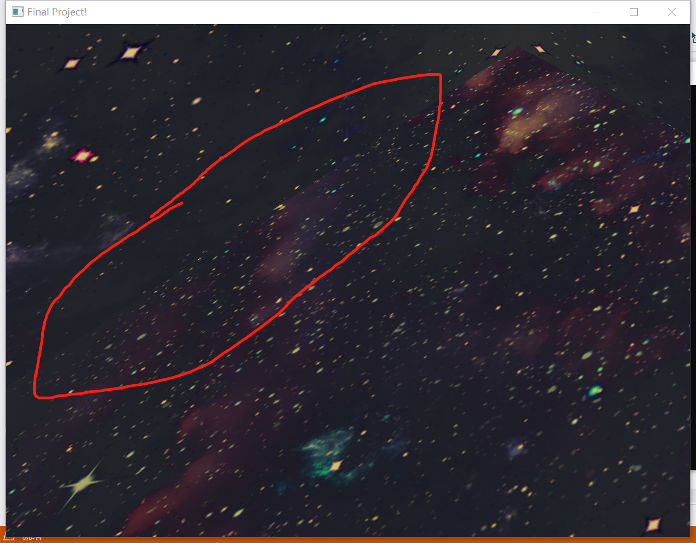
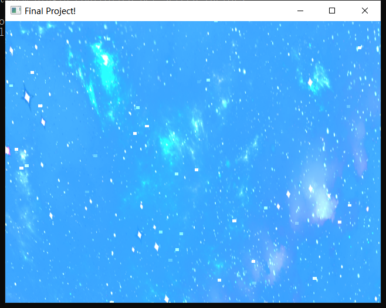
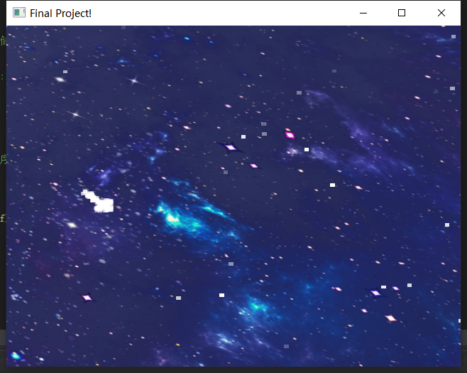
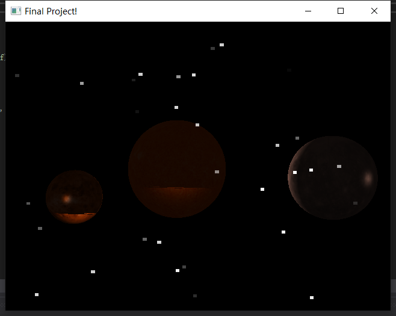
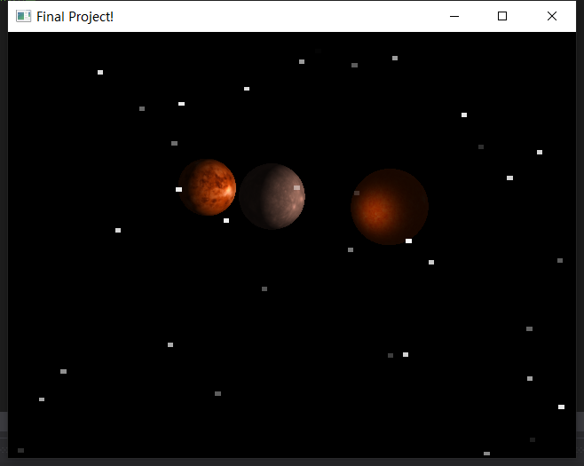
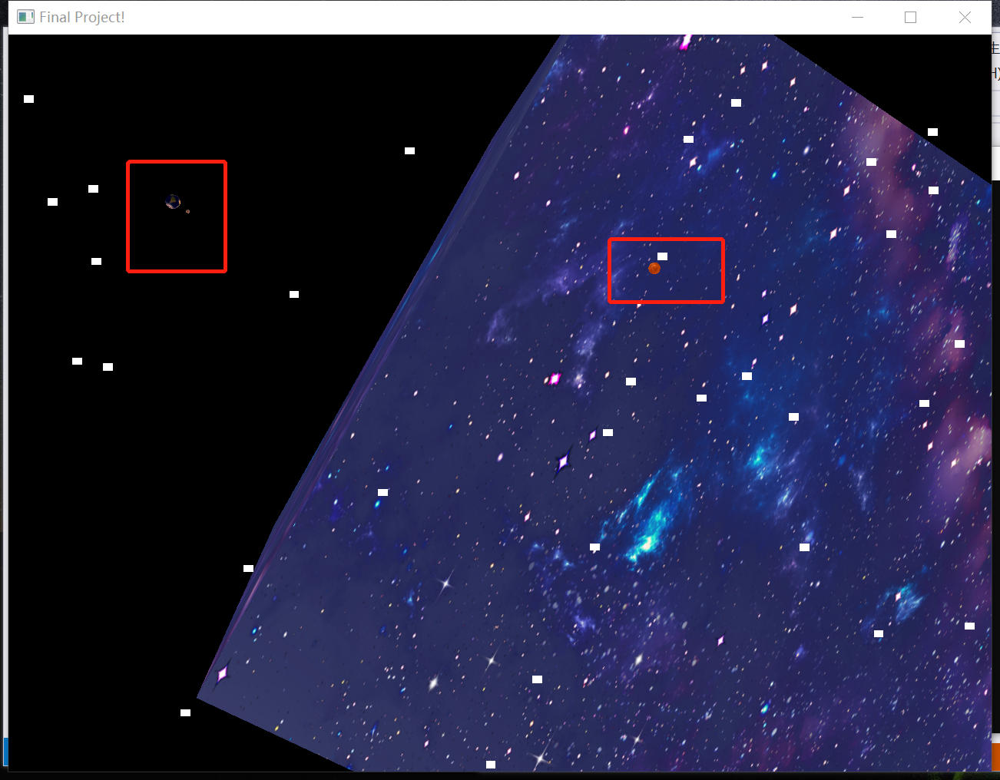

## 期末大作业小组报告

> **小组成员**
>
> 李钰		19335112
>
> 韦媛馨	19335206
>
> 陈禹翰	19335025

### 一、选题意义

​		星河浩瀚，宇宙神秘而美丽，如果我们可以通过这一学期在计算机图形学课上学到的内容简单地模拟出这个场景，自认为将会是一件非常有成就感的事情。

​		我们将课程中学习到的渲染管线、纹理贴图、Phong光照模型等知识进行实践，也是对作业三使用VBO绘制小球的深入学习与升华，更有对课外知识的探索与研究，例如我们用VBO结合了IBO进行球体的绘制、学习了可编程渲染管线、加入了照相机的功能让动画有了交互功能、学习了粒子系统的实现、引入了天空盒的制作，增加了场景真实性，使得用户有更好的体验。

### 二、预期完成目标

**初步想法**

创建一个动画模拟宇宙的复杂场景，包括太阳系及其他星体，加入星体的自转以体现光影效果，加入流星、银河、黑洞等。

**进阶想法**

实现交互，可以在宇宙中移动变换视角，动态渲染生成边界的星体。

### 三、实际完成

​		模拟了太阳系各行星绕太阳进行公转、自身自转的动画场景，其中体现了光影变幻的效果。又通过粒子系统模拟了宇宙中繁星闪烁、星体爆炸、流星划过的场景。增加了天空盒的制作，通过纹理贴图等技术增加动画真实性。实现了和用户交互的功能，用户可以通过鼠标操作来调整视角，全方位多角度地观察，仿佛身临其境。

​		所以总体来说，基本完成了初步想法和进阶想法。

### 四、遇到的困难

**个人制作时的困难：**

1. 绘制流星时，比较繁琐的是设置各种参数，例如流星的消逝参数、各方向的运动速度及加速度等。它们的取值以及如何变化很大程度地影响了最后效果的真实性。流星的形状绘制也花费了一些时间，为了模拟出带有尾迹的流星，最后按照一个箭头的形状来作图了。然后还需要注意的一点是，绘制流星时要关闭深度探测，否则纹理之间会出现覆盖现象，画面就很糟糕了。

2. 立方体贴图的边界会比较明显：

   

   解决方案：将Wrapping方式由`REPEAT`改为`GL_CLAMP_TO_EDGE`效果会稍好一些，不过也不能完全避免。另一种可能的方式是采用球面贴图去实现，但因为时间有限，就没有实现。

**小组项目融合时出现的困难：**

1. 流星和天空盒背景进行融合时，出现了整体背景变蓝的情况，后来发现是因为绘制流星的融合因子设计的有问题，渲染时要注意原图和目标图像之间颜色如何换算，修改之后恢复正常。

      

2. 流星和星体融合时，星体的绘制受到了影响。后来发现是因为流星的绘制需要关闭深度探测，但是绘制星体时需要开启。之后作出修改，在绘制流星时关闭深度探测，绘制完成之后立即开启，修改之后恢复正常。

         

3. 代码整合的时候发现天空盒会随着camera而移动，这样呈现出来的效果是很奇怪的，而且很可能camera前进到一定程度的时候就到了天空盒外面（比如下图），后来debug出来的原因是在主程序调用`drawSkybox()`绘制天空盒将`camera.getView()`作为`view`参数传入，相当于`skybox`的渲染管线进行了一次`shaderProgram.setUniformValue("view", camera.getView()`操作，结果就是观察天空盒的视角就是camera观察到的视角，解决方案是在`drawSkybox()`中不需要`view`参数。

（在结束这个debug之后又对着色器和星球的大小进行了调整，所以呈现出来的效果不太一样）

4. 整合代码的以后一开始是很混乱的，因为开始大家没有很明确的“解耦合”的概念，都在主程序用不同的着色器实现，但不同的着色器存在不同的顶点数据和纹理，调用之后一个模型会绑定的数据缓存会影响另一个，这时候体会到`bind()`和`release()`的意义。之后我们在各自部分`draw()`函数中就知道了需要先绑定着色器，使用完之后要进行解绑，有点像操作系统中的“锁”的概念。

### 五、功能描述

​	**鼠标操作**

- 通过移动鼠标可以改变观察视角；

- 通过滚轮操作可以进行放大或缩小场景；

​	**键盘操作**

- Esc键关闭窗口，结束进程
- Tab键触发小爆炸的场景
- Z键触发流星划过的场景
- Shift+滚轮产生相机加速效果

### 六、最终效果

​		太阳系的行星都在自己的轨道上以一定的速度绕太阳公转，同时也在自传，地月系中，月球绕着地球转，同时也自传。由于按照实际情况等比例缩小模型的话，很难呈现出整体效果，所以这里调整了星球的公转半径以及它们之间的相对大小，更好的看到最终效果。

​		可以通过鼠标或键盘操作来选择自己想要观察的星体、视角等，也可以制造流星、爆炸等场景。

​		项目的静态截图如下，动态效果可见视频文件。

### 七、小组分工

陈禹翰：绘制星体、照相机功能

韦媛馨：绘制天空盒、融合项目debug、制作PPT视频

李钰：绘制流星、融合项目debug

**Note:** 项目开源到了GitHub上：https://github.com/lzzmm/CGFinalProject
